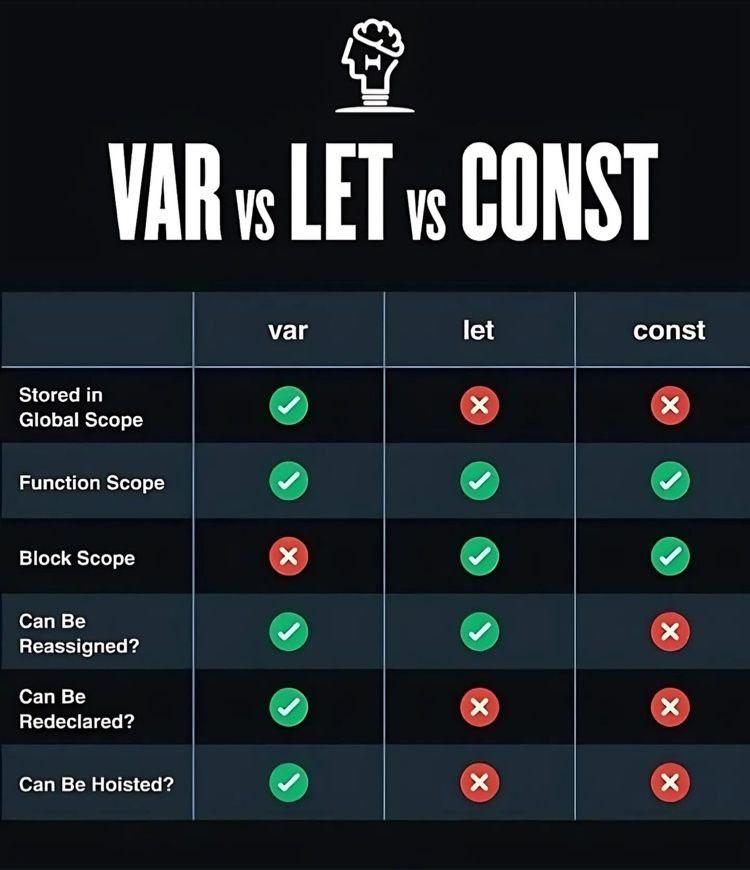

# Advanced-JavaScript-React
1. Default Parameters
2. Template Literals
3. Three dots operator(...)
4. Destructuring Assignment 
5. Let and Const
6. Arrow Functions 
7. Modules
8. Map
9. Filter
10. Reduce
11. Promises
12. Async & await

## Default Parameters
ES6 allows function parameters to have
default values.But, in ES5, OR operator had
to be used.
```javascript
//ES5
var userName = function (firstName, lastName) {
    firstName = firstName || 'random';
    lastName = lastName || "random";
    //logic
}

//ES6
//normal function
let userName = function (firstName = 'random', lastName = 'random') {
    //logic
}
//arrow function 
let userName =  (firstName = 'random', lastName = 'random') => {
    //logic
}
```
## Template Literals 

ES6 introduces very simple string templates
along with placeholders for the variables.
The syntax for using the string template is
${PARAMETER} and is used inside of the
back-ticked string.

```javascript
//ES5
var name = 'Your name is' + firstName + ''+ lastName; 

//ES6
const name = `Your name is ${firstName} ${lastName};
```
## Three dots operator 

In ES6, The three dots operator (...)
- The spread operator
- The rest operator

The rest and spread operators help in adding values 
to the array and object

### Spread Operator

```javascript 
//Array
const arr1 = [1, 2];
const arr2 = [3, 4];
const combined = [...arr1, ...arr2];

//Object
const obj1 = {a:1};
const obj2 = {b:2};
const obj3 = {...obj1, ...obj2}
```
- Merging arrays or objects.
- Shallow copying of arrays or objects, that is copying without modifying them in any way.

## Rest operator
- It possible to
create a function that accepts any
number of arguments.
- It is used for destructuring arrays and
objects.
- The rest parameter has to be the last
parameter in the function.

```javascript
function sum(...numbers) {
  return numbers.reduce((acc, num) => acc + num, 0);
}
console.log(sum(1, 2, 3, 4)); 
```

## Destructuring Assignment

- Destructuring allows easy to assign values from arrays or objects into different variables.

```javascript
// Object Destructuring

const person = { name: 'random', age: 32 };
const { name, age } = person;

//Array Destructuring

const numbers = [1, 2, 3];
const [first, second] = numbers;
```

## Let and Const
- JavaScript developers had only one way of declaring their variables and that was using the var keyword; however, it had its vices which included variable hoisting and scope leakage. ES6 introduced let and const to address these issues.

